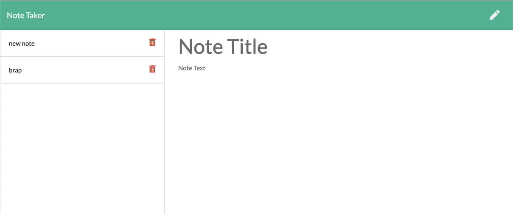

# Note Taker application

## Description

An application built to demonstrate the capabilities of node.js and the express module to create an interactive application that lets users create and save notes.

  
# Table of Contents

  **[Installation Instructions](#intallation-instructions)** 
  **[Controbutors](#contributors)** 
  **[License Information](#license)** 
  
## Installation Instructions
Clone the repo and run npm install to install all node packages then run the server.js file using node.
Open your browser and type localhost:3000 as the url.

  
## Contributors
Oli Saxon

  
# Questions

Visit my GitHub page [here](https://github.com/osaxon).

Email me with questions at [oliverrsaxon@gmail.com](oliverrsaxon@gmail.com).

